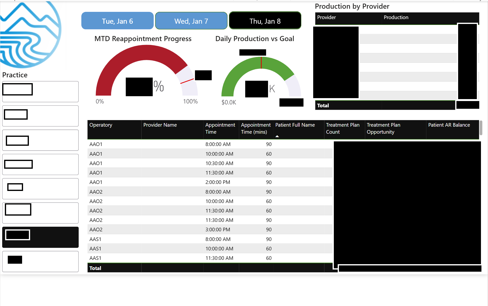
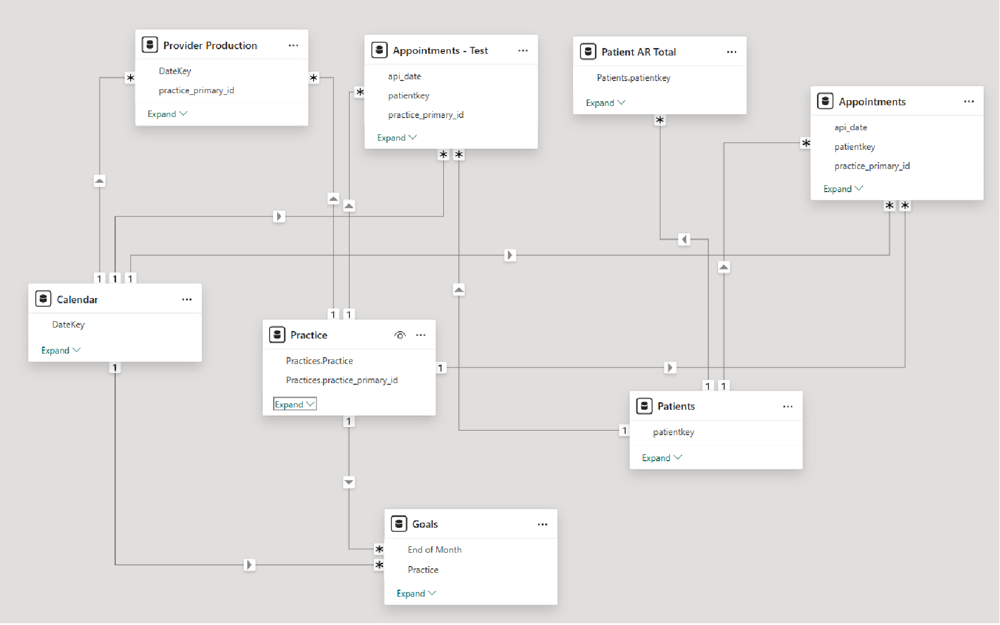
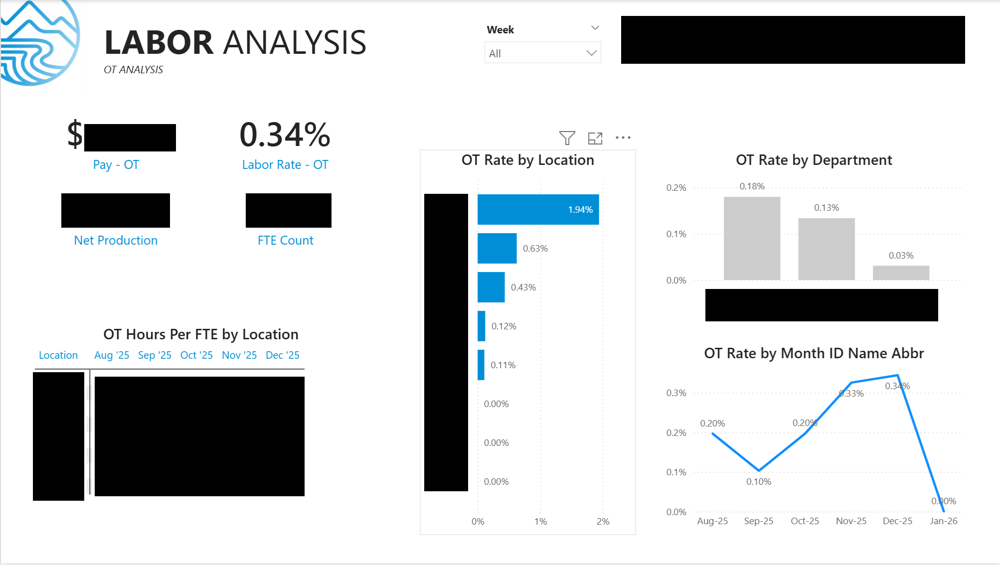
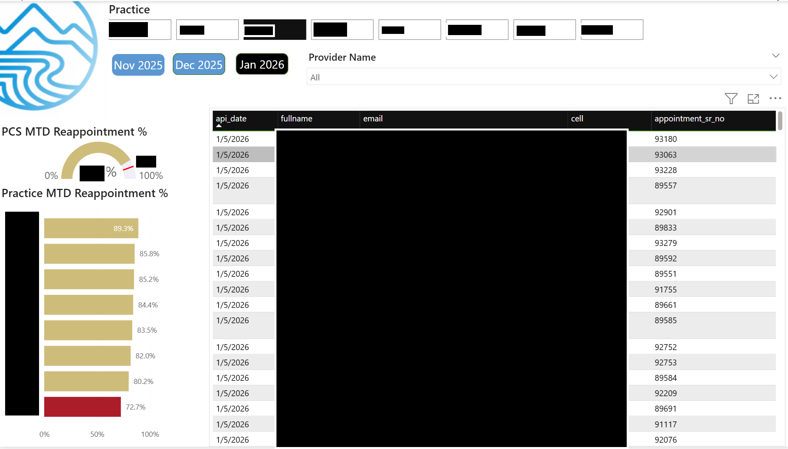

# Frontline Operational Enablement

**Goal**  
Create a daily operating system for practice leaders that turns production, labor, and schedule data into clear, actionable decisions.

**Outcomes**
- Designed and implemented a customized daily operating tool that improved speed and clarity of frontline decision-making.
- Identified a recurring ~$3,000 per month overtime gap, enabling reallocation of staffing resources and tighter labor control.

**Approach**  
Built on a structured star schema integrating production, labor, and scheduling data to ensure consistent metric definitions across locations. Leveraged DAX time intelligence, business day normalization, and variance logic to translate raw operational data into decision-ready signals.

**Tools**  
SQL Server Analysis Services (SSAS) · Power Query · Power BI (Modeling & Visualization) · DAX

# Projects
- Morning Huddle Dashboard
- Overtime and Labor Dashboard
- Hygiene Re-appointment Opportunity Dashboard

## 1) Morning Huddle Dashboard

Daily production and schedule pacing tool used by practice leaders to identify same-day gaps and near-term risks.

**Focus Areas**
- Production vs target (daily and MTD)
- Schedule fill rate and open chair time
- Provider-level pacing and bottlenecks
- Early identification of underfilled hygiene or doctor days

Data Model:
  

## 2) Overtime and Labor Dashboard

Operational labor diagnostic tool used to understand where staffing levels diverge from production demand.

**Focus Areas**
- Overtime concentration by role and location
- Labor cost per unit of production
- Business day normalization
- Variance vs prior period and target

## 3) Hygiene Re-appointment Opportunity Dashboard

Bridging tool connecting historical performance to near-term revenue pipeline.

**Focus Areas**
- Resource to facilitate future practice growth
- Reduce hygiene re-appointment leakage
- Risk-adjusted outlook based on schedule health
